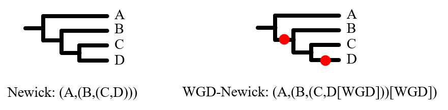

# IAGS_AUTO

The project is based on IAGS and automates process

[中文版本](utils/static/README_ZH.md)

## Usage

### Files

The IAGS_AUTO tool requires three types of files: species GFF files, an orthogroup.tsv file, and a species.tree file. Please place these three types of files in the same folder. The GFF and orthogroup.tsv files are the same as those required for the previous script ([processDrimm](https://github.com/99gloom/processDrimm)).

The following will be introduced one by one:

1. GFF files: The GFF files have the same format as the input for [MCScanX](https://github.com/wyp1125/MCScanx). The file contains four columns, namely chromosome name, gene name, gene start coordinate, and gene end coordinate. The format is as follows:

   ```text
   sp_name  gene_name  starting_position  ending_position
   ```
2. Orthogroups.tsv: The output file of [OrthoFinder](https://github.com/davidemms/OrthoFinder).
3. species.tree: WGD-Newick format. Essentially a modified version of the Newick format, with the addition of "[WGD]" markers at the WGD (Whole Genome Duplication) positions in the tree. In the figure below, the red dots represent WGD markers.
   

### Application

<table>
<tr>
<th width="120">command</th>
<th width="200">parameters</th>
<th width="400">instructions</th>
</tr>
<tr>
<td>-f, --filepath</td>
<td>./file_dir</td>
<td>Directories where the three required files are stored</td>
</tr>
<tr>
<td>-c, --cycleLength</td>
<td>The default value is 20</td>
<td>The continuity of synteny blocks</td>
</tr>
<tr>
<td>-d, --dustLength</td>
<td>Default value is all species copy number plus 1</td>
<td>It controls the upper limit of gene family. The gene family will be filtered when homologous genes exceeding dustThreshold</td>
</tr>
<tr>
<td rowspan="2">-s, --shape</td>
<td>"s" (Default)</td>
<td rowspan="2">Chromosome shape. "s" represents string chromosomes and “c”
represents circular chromosomes.</td>
</tr>
<tr>
<td>"c"</td>
</tr>
<tr>
<td rowspan="3">-m, --model</td>
<td>"manual"</td>
<td rowspan="2">Default is None. When users need to specify the outgroup manually, first use the "manual" mode to generate the node computation order file "model_and_outgroup.txt", and modify the information of the outgroup used. Then use "continue" mode to generate the result based on the problem pieces modified in the previous step.</td>
</tr>
<tr>
<td>"continue"</td>
</tr>
<tr>
<td>"dotplot"</td>
<td>Generate a two-by-two dotplot for each species</td>
</tr>
</table>

### Result

The "Result" folder will be generated in the run directory, and there are subfolders inside, which are Tree_File, Process_Drimm, and IAGS in the order of generation. The files that the users are primarily concerned about are "IAGS" and "model_and_outgroup.txt" in "Tree_File". "IAGS" is the final generated ancestors genome result and chromosome painting. "model_and_outgroup.txt" is the outgroup information used by each ancestor node, which requires additional processing if manually specified.

The role of each file is described in more detail below:

+ Tree_File
  + species.ratio and all.ratio: Copy number information for all species;
  + Evolutionary_tree.txt: Evolutionary tree shape and distribution of all nodes;
  + model_and_outgroup.txt: Information about each ancestor node computation in the format: currently computed ancestor node : IAGS computation model : child node : outgroup. If the model is GMP or MultiCopyGMP, there are two child nodes. In particular, in the MultiCopyGMP model, if its outgroup does not have enough copy number, the outgroup chromosome will be doubled manually to compute, denoted by "*N".
+ Process_DrimmEssentially an automated process for [processDrimm](https://github.com/99gloom/processDrimm).
  + Process_OrthoFind: Gene sequences were generated by coding genes through species GFF and orthogroup.tsv files;
  + Drimm_Synteny_Output: Raw results generated after running DRIMM;
  + Drimm_Blocks: LCS (Longest Common Subsequence arithmetic, described in the [processDrimm](https://github.com/99gloom/processDrimm)) of the raw results from the DRIMM run for downstream analysis;
  + Final_Blocks: Filter Drimm_Blocks proportionally to generate blocks that can be run by IAGS.
+ IAGS
  + Name of each ancestor node: Ancestor node details including computed blocks, CRB ratio evaluation etc;
  + painting: Chromosome painting of the ancestral genome, where "Painting_start_point.txt" records the basal ancestor of the drawing;
  + shufflingEvents.txt: Species fission and fusion information.

### Example

+ 1.Quick start

  ```shell
  python IAGS_AUTO -f ./example
  ```
+ 2.Specified parameter

  ```shell
  python IAGS_AUTO -f ./example -c 60 -d 12 -s s
  ```
+ 3.Manual designation of outgroups

  ```shell
  python IAGS_AUTO -f ./example -m manual
  ```

  Subsequently change the outgroups in "Result/Tree_File/model_and_outgroup.txt" and continue to run.

  ```shell
  python IAGS_AUTO -f ./example -m continue
  ```
+ 4.Painting dotplot

  ```shell
  python IAGS_AUTO -f ./example -m dotplot
  ```

  Using this command generates an additional "Dotplot" folder in "Result" where the results will be stored.

## Support

Since IAGS is based on [gurobi](https://www.gurobi.com) for integer optimization, this tool requires users to download and activate the gurobi license by themselves, here we provide a [help document](utils/static/gurobi.md) to help users install and activate gurobi.