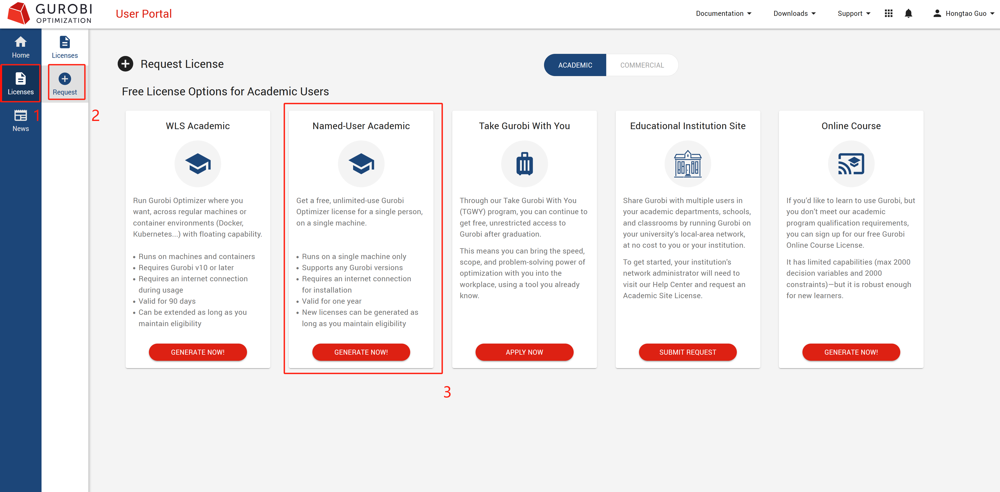
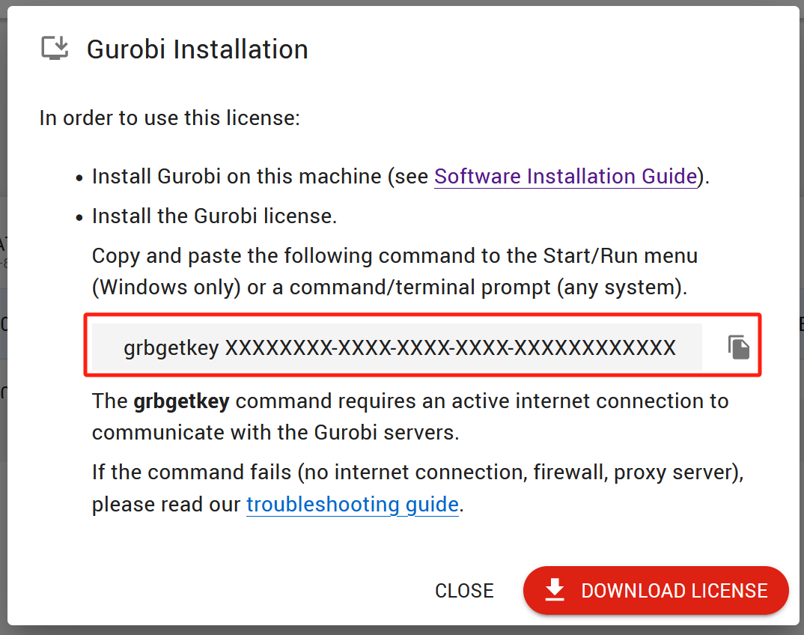

# Installation of gurobi

## Download and install gurobi

Download the corresponding version of [gurobi](https://www.gurobi.com/downloads/gurobi-software/) from the official website, here is an example for Linux.


### Installation and configuration

1. unzip
    ```shell
    tar -xvfz gurobi10.0.3_linux64.tar.gz
    ```

2. configuration
   Since IAGS calls gurobi in python, there are two ways to install the gurobipy library:
   1. pip/conda：

      ```shell
      # pip install
      pip install gurobipy

      # conda install
      conda install gurobipy
      ```
   2. local installation

      Execute the command in the unzipped gurobi/linux64 directory:

      ```shell
      python setup.py install
      ```

3. Adding Environment Variables

   Entering `vim ~/.bashrc` in the terminal and add it to the file afterwards:

   ```shell
   export GUROBI_HOME="/home/.../gurobi1003/linux64"
   # ... is the path where gurobi is installed
   export PATH="${PATH}:${GUROBI_HOME}/bin"
   export LD_LIBRARY_PATH="${LD_LIBRARY_PATH}:${GUROBI_HOME}/lib"
   ```

4. Reset environment variables

   ```shell
   source ~/.bashrc
   ```

## Activate gurobi

The academic license is free and activate for one year per activation.

1. Register and Login
   <div align="center">
   

   Use campus email whenever possible.
   </div>

2. Access to the user license portal

   <div align="center">
   
   </div>

3. Apply for license

   <div align="center">
   
   </div>


4. Get key


   <div align="center">
   
   </div>

   View the key you just applied for in the license screen and click on the second red box to view your key.

   <div align="center">
   

   The application was successful here.
   </div>


5. Activate gurobi

   ```shell
   # Go to the gurobi installation directory
   cd /gurobi1003/linux64/bin

   # Activate the key you just requested
   # After successful activation, a gurobi.lic file will be created, which is stored in the current folder by default
   grbgetkey ********-****-****-****-***********
   ```

   Updating environment variables is more similar to the steps taken during installation:

   ```shell
   vim ~/.bashrc
   export GRB_LICENSE_FILE="/home/....../gurobi.lic"
   ```

6. Test

   <div align="center">

   After the above steps, enter the command `gurobi.sh` to test whether the installation is successful, the following screen appears that is successful

   
   </div>
