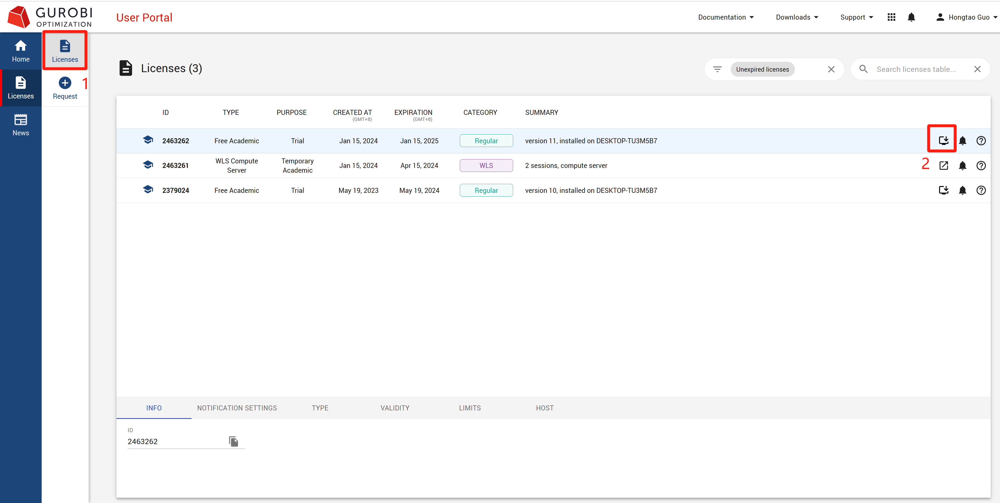
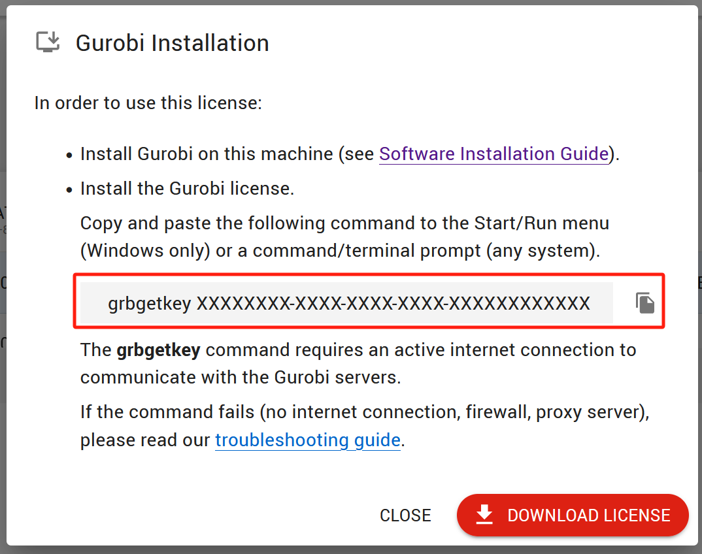
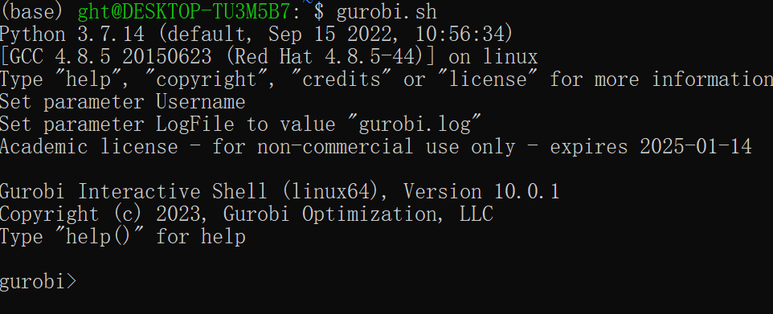

# 安装gurobi

## 下载并安装gurobi

于官网网站下载对应版本[gurobi](https://www.gurobi.com/downloads/gurobi-software/)，这里以Linux举例。

### 安装并配置

1. 解压
    ```shell
    tar -xvfz gurobi10.0.3_linux64.tar.gz
    ```

2. 配置  
   因为是在python中调用gurobi，有两种方式安装gurobipy库：  
   1. pip/conda：

      ```shell
      # pip安装
      pip install gurobipy
      
      # conda安装
      conda install gurobipy
      ```
   2. 本地安装  

      在解压后的gurobi/linux64目录下执行命令：

      ```shell
      python setup.py install
      ```

3. 添加环境变量  
   
   终端中输入`vim ~/.bashrc`，之后在文件中添加：

   ```shell
   export GUROBI_HOME="/home/.../gurobi1003/linux64"
   # ... 为gurobi安装的路径 
   export PATH="${PATH}:${GUROBI_HOME}/bin"
   export LD_LIBRARY_PATH="${LD_LIBRARY_PATH}:${GUROBI_HOME}/lib"
   ```

4. 重置环境变量
   
   ```shell
   source ~/.bashrc
   ```

## 激活gurobi

学术license免费并每次激活可使用一年。

1. 注册登录
   <div align="center">
      

   尽量使用校园邮箱。
   </div>

2. 进入用户license入口

   <div align="center">
      
   </div>

3. 申请license

   <div align="center">
      
   </div>


4. 获得key


   <div align="center">
      
   </div>

   在license界面查看刚申请的key，并点击第二个红框，查看自己的key

   <div align="center">
      
   
   这里就申请成功了。
   </div>

   

5. 激活gurobi

   ```shell
   # 进入gurobi安装目录
   cd /gurobi1003/linux64/bin

   # 激活刚刚申请的key
   # 激活成功后会生成gurobi.lic文件，默认存放于当前文件夹
   grbgetkey ********-****-****-****-*********** 
   ```

   更新环境变量，与安装时的步骤比较类似：

   ```shell
   vim ~/.bashrc
   export GRB_LICENSE_FILE="/home/....../gurobi.lic" 
   ```

6. 测试  

   <div align="center">
   
   上述步骤走完之后，输入命令`gurobi.sh`测试是否安装成功，出现如下画面即为成功
   
      
   </div>
